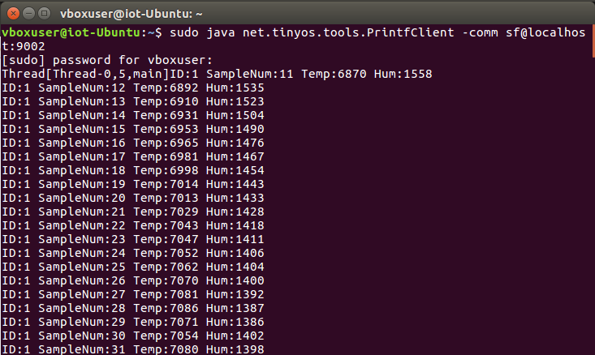
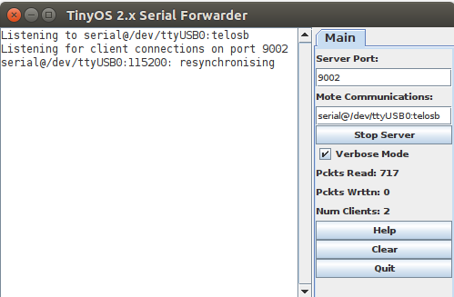

# TinyOS Setup Guide: Ubuntu 16.04 on VirtualBox

This guide explains how to set up Ubuntu 16.04 in VirtualBox, configure
USB access for TelosB and Iris motes, and install TinyOS.

------------------------------------------------------------------------

## 1. Download and Install Required Software

Download and install the following:

-   VirtualBox
-   VirtualBox Extension Pack
-   Ubuntu 16.04 ISO

**Make sure you check the "Install Guest Additions" option in the "Set up unattended guest OS installation" when installing Ubuntu 16.04 LTS in the Virtual Box.** 

------------------------------------------------------------------------

## 2. Enable `sudo` and Terminal Access

Boot Ubuntu 16.04 into recovery mode:

1.  While Ubuntu 16.04 LTS is booting, hold the **SHIFT** key.

2.  Choose:

    ``` text
    Advanced Options for Ubuntu -> <kernel_version> (recovery mode)
    ```

3.  Choose **root** and press **ENTER**.

Remount the filesystem as writable:

``` bash
mount -o remount,rw /
```

Add your user to the `sudo` group:

``` bash
adduser <your_username> sudo
```

Edit the locale file:

``` bash
nano /etc/default/locale
```

Update the entries so that all values are:

``` text
en_US.UTF-8
```

Save and exit, then run:

``` bash
locale-gen
reboot
```

Verify terminal access after reboot:

1.  Log in to Ubuntu 16.04.
2.  Press:

``` text
Ctrl + Alt + T
```

------------------------------------------------------------------------

## 3. Add User to `vboxusers` in the host machine (only if the host machine is Linux based)

``` bash
sudo adduser $USER vboxusers
```

Then log out and back in, or reboot.

------------------------------------------------------------------------

## 4. Install VirtualBox Recommendations

Add the VirtualBox Extension Pack:

Extensions > Install > \<the downloaded extension pack\>

------------------------------------------------------------------------

## 5. Configure USB Devices in VirtualBox

1.  Close the VM.

2.  Plug in the TelosB and Iris motes.

3.  In VirtualBox, right-click the VM.

4.  Go to:

    ``` text
    Settings -> USB
    ```

5.  Click **Add Filter**.

6.  Choose the Iris and TelosB motes.

------------------------------------------------------------------------

## 6. Update and Upgrade Packages

Run:

``` bash
sudo apt update && sudo apt upgrade
```

------------------------------------------------------------------------

## 7. Install Necessary Packages

Run:

``` bash
sudo apt install -y python2.7 python-minimal openjdk-8-jdk gcc-avr avr-libc nescc minicom wget unzip automake autoconf libtool avrdude curl gcc-msp430 git python-serial tinyos-tools
```

------------------------------------------------------------------------

## 8. Install TinyOS

Clone the TinyOS repository:

``` bash
git clone https://github.com/tinyos/tinyos-main.git
```

Go into the TinyOS tools directory:

``` bash
cd ~/tinyos-main/tools
```

Build and install TinyOS tools:

``` bash
./Bootstrap
./configure
make
sudo make install
```

------------------------------------------------------------------------

## 9. Configure USB Permissions

Add your user to the `dialout` group:

``` bash
sudo usermod -aG dialout $USER
```

Reboot:

``` bash
reboot
```

## 10. Create Shared Folder

1. Close the VM
2. Go to Settings > Shared Folders > Add new shared folder
3. Pick a folder (or better, create a new one to the Host machine and choose this one)
4. Check the auto-mount option
5. apply changes and open the VM
6. In the terminal, run:
``` bash
sudo usermod -aG vboxsf $USER
```
7. Log-out and login back or reboot

------------------------------------------------------------------------

## Done

Ubuntu 16.04, TinyOS, and mote USB access should now be configured.

# Περαιτέρω οδηγίες

## Σχετικά με τις μετρήσεις

1. Όσες ομάδες έχουν TelosB mote, να χρησιμοποιήσουν τους πραγματικούς sensors του TelosB
2. Όσες ομάδες δεν έχουν TelosB mote, να χρησιμοποιήσουν 'fake' μετρήσεις.

Συγκεκριμένα, μελετήστε το παράδειγμα Sensing. Όσοι έχουν TelosB, να χρησιμοποιήσουν το tmote_onboard_sensors module, ενώ όσοι δεν έχουν να χρησιμοποιήσουν το universal_sensors module. Περισσότερες λεπτομέρειες στο README του παραδείγματος.

## Εύρεση των θυρών USB

Για να βρείτε σε ποιά θύρα USB είναι συνδεδεμένο το mote, χρησιμοποιήστε την παρακάτω εντολή:

``` bash
ls /dev | grep ttyUSB* 
```

## Compile and Flash programs

### TelosB

Για να φορτώσετε κώδικα στα TelosB εκτελείτε τις παρακάτω εντολές:

``` bash
sudo make clean  // Optional, but useful sometimes
sudo make telosb install.<TOS_NODE_ID>  bsl,/dev/ttyUSBx  // Βρείτε τη θύρα USB στην οποία είναι συνδεδεμένη η συσκευή σας
```

Παράδειγμα εκτέλεσης:

``` bash
sudo make clean
sudo make telosb install.0 bsl,/dev/ttyUSB0 // Εδώ περνάμε TOS_NODE_ID=0 και το mote είναι συνδεδεμένο στη θύρα USB0
```

### IRIS

Αντίστοιχα, για τα IRIS χρησιμοποιήστε τις παρακάτω εντολές:
``` bash
sudo make clean
sudo make iris install.<TOS_NODE_ID> mib520,/dev/ttyUSBx  // Βρείτε τη θύρα USB στην οποία είναι συνδεδεμένη η συσκευή σας
```

Παράδειγμα εκτέλεσης:

``` bash
sudo make clean
sudo make telosb install.0 bsl,/dev/ttyUSB0 // Εδώ περνάμε TOS_NODE_ID=0 και το mote είναι συνδεδεμένο στη θύρα USB0
```

**Προσοχη: Όταν συνδέσετε ένα TelosB mote, θα δείτε ότι εμφανίζει μία μόνο θύρα USB στον φάκελο /dev. Ωστόσο, για το IRIS mote, εμφανίζει 2 θύρες. Θα χρησιμοποιήσετε την 1η θύρα μόνο κατα τη διαδικασία flash την εφαρμογής σας και τη δεύτερη θύρα μόνο όταν θέλετε να διαβάσετε output της συσκευής (π.χ. τα αποτελέσματα των printf εντολών σας).**

## PrintfClient

Αν γράψετε printf εντολές, τότε πρέπει να ξεκινήσετε έναν PrintfClient για να μπορέσετε να δείτε τα αποτελέσματα των printf εντολών. Για να το κάνετε, εκτελέστε μία από τις παρακάτω εντολές, ανάλογα με το mote που θέλετε να ελέγξετε:

### TelosB

``` bash
sudo java net.tinyos.tools.PrintfClient -comm serial@/dev/ttyUSBx:telosb   // Βρείτε τη θύρα USB στην οποία είναι συνδεδεμένο το mote
```

### IRIS
```bash
sudo java net.tinyos.tools.PrintfClient -comm serial@/dev/ttyUSBx:iris   // Βρείτε τη θύρα USB στην οποία είναι συνδεδεμένο το mote
```

## SerialForwarder

Προτείνουμε, αντί να ξεκινήσετε έναν Client ο οποίος θα "μιλάει" κατευθείαν με τη θύρα USB, μπορείτε να ξεκινήσετε ένα Network Socket, το οποίο θα "μιλάει" με τη συσκευή μέσω UART και o Client θα "μιλάει" με το Network Socket. Γενικά, είναι πιο stable σαν μέθοδος. Επίσης, optionally μπορείτε να χρησιμοποιήσετε και το δικό σας port number. Το default είναι 9002.

### TelosB (Παράδειγμα για PrintfClient)
``` bash
sudo java net.tinyos.sf.SerialForwarder -comm serial@/dev/ttyUSB*:telosb <-port 9002> // Βρείτε τη θύρα USB στην οποία είναι συνδεδεμένο το mote
sudo java net.tinyos.tools.PrintfClient -comm sf@localhost:<port>
```

### IRIS (Παράδειγμα για PrintfClient)
``` bash
sudo java net.tinyos.sf.SerialForwarder -comm serial@/dev/ttyUSB*:iris <-port 9002> // Βρείτε τη θύρα USB στην οποία είναι συνδεδεμένο το mote
sudo java net.tinyos.tools.PrintfClient -comm sf@localhost:<port>
```


# Προτάσεις

Δείτε αναλυτικά τα παρακάτω παραδείγματα που περιέχονται στη βιβλιοθήκη, καθώς και τα παραδείγματα (examples) που δίνονται στο παρόν Repository:

1. examples/Blink
2. examples/BlinkToRadio
3. examples/Sensing

Τα παραδείγματα αυτά είναι παραλλαγές των αρχικών παραδειγμάτων του TinyOS:

1. apps/Blink
2. apps/tutorials/BlinkToRadio
3. examples/LowPowerSensing

# Αναφορά

## Εισαγωγή

Η παρούσα εργασία πραγματοποιήθηκε στο πλαίσιο του μαθήματος AIoT (Artificial Intelligence of Things), από τους Δινοβίτση Μενέλαο, Δραγουδάκη Αναστάσιο, Κουτσοβασίλη Χρήστο για το ακαδημαϊκό έτος 2025-2026 και αφορά την υλοποίηση ενός ολοκληρωμένου συστήματος Ασύρματου Δικτύου Αισθητήρων (Wireless Sensor Network – WSN). Στην εργασία αυτή, υλοποιήθηκε ένα WSN σε τοπολογία αστέρα με χρήση TelosB motes και του λειτουργικού συστήματος TinyOS. Συγκεκριμένα, το σύστημα που αναπτύχθηκε περιλαμβάνει τη μέτρηση θερμοκρασίας και υγρασίας μέσω του αισθητήρα TelosB, την αποθήκευση των δεδομένων σε βάση δεδομένων MongoDB σε πραγματικό χρόνο, την οπτικοποίησή τους μέσω web εφαρμογής και τέλος την εφαρμογή τεχνικών μηχανικής μάθησης (Linear Regression και ARIMA) για την πρόβλεψη μελλοντικών τιμών. 

## 1ο μέρος

Στο πλαίσιο του ερωτήματος 1, για την ορθή εγκατάσταση και ρύθμιση των VirtualBox και Ubuntu (16.10) ακολουθήσαμε τις οδηγίες του αρχείου README.md στο github. Έπειτα προχωρήσαμε στην δημιουργία ενός καινούργιου Virtual Machine, στο οποίο και έγινε clone το repo του github για άμεση πρόσβαση στα παραδείγματα ρύθμισης των motes. Αφού δοκιμάστηκε η σωστή λειτουργία των δύο TelosB motes με τα Blink και BlinkToRadio scripts, τα τοποθετήσαμε κατάλληλα ώστε το Base mote, που είναι συνδεδεμένο απευθείας με τον υπολογιστή, να λειτουργεί ως ο κεντρικός κόμβος συλλογής δεδομένων (sink node) και ο Leaf node (sampler) ως περιφερειακός κόμβος που του μεταδίδει απευθείας τις μετρήσεις σε ένα hop, επιβεβαιώνοντας την τοπολογία αστέρα. Έπειτα, τροποποιήσαμε τους κώδικες SensingPeriodicSamplerC.nc και SensingBaseC.nc ώστε ο Sampler αντί να βασίζεται σε αποθήκευση δειγμάτων (logging) να πραγματοποιεί περιοδική δειγματοληψία, όπου ο Timer του ενεργοποιεί διαδοχικές αναγνώσεις θερμοκρασίας-υγρασίας ανά 20 δευτερόλεπτα (SampleTimer.startPeriodic(20000);) και άμεση αποστολή στην βάση. Από την άλλη, ο Base mote ενώ στην αρχή εκτύπωνε απευθείας στο Ubuntu Terminal το ID του leaf node από τον οποίο λαμβάνει το πακέτο, τροποποιήθηκε ώστε να εκτυπώνει τις μετρήσεις που αντιστοιχούν σε αυτό και τον αύξοντα αριθμό του σε μια γραμμή, όπως παρατηρούμε και από κάτω:
``` bash
printf("ID:%u SampleNum:%lu Temp:%u Hum:%u\n", src, (uint32_t)s->sample_num
    ,(uint16_t)s->temperature, (uint16_t)s->humidity);
```


Τέλος, αξιοποιούμε την συνεργασία Serial Forwarder και PrintfClient για την μετάδοση δεδομένων. Ο Serial Forwarder λειτουργεί ως εξυπηρετητής (server) που αναλαμβάνει τη χαμηλού επιπέδου επικοινωνία με το υλικό, δεσμεύοντας τη σειριακή θύρα USB της Βάσης για να μεταδώσει τα ακατέργαστα δεδομένα και προωθώντας τα μέσω μιας τοπικής δικτυακής θύρας (TCP 9002) όπως φαίνεται παρακάτω:


Εδώ, βλέπουμε το Server Port που χρησιμοποιούμε (9002), τον αριθμό πακέτων που έχει διαβάσει το Base Mote, και τον αριθμό των clients. Στην προκειμένη περίπτωση είναι 2, διότι στην θύρα "ακούν" το Base Mote και το wsn_collector.py script για να αποθηκεύσει τα δεδομένα στην MongoDB.
Αντίστοιχα, ο PrintfClient λειτουργεί ως πελάτης (client) που συνδέεται σε αυτή τη δικτυακή θύρα, λαμβάνει τα δεδομένα, τα επεξεργάζεται και τα μετατρέπει σε κείμενο.


## 2ο μέρος
Στο δεύτερο ερώτημα, πραγματοποιήται η δημιουργία της βάσης MongoDB και η αποθήκευση των δεδομένων των αισθητήρων σε αυτή. 
Η βάση MongoDB αποτελεί την ιδανική βάση για το ασύρματο δίκτυο αισθητήρων που υλοποιήται στην παρούσα εργασία καθώς η εύκολη χρήση της και η ακαριαία ταχύτητα αποθήκευσης των δεδομένων των αισθητήρων, είναι αναγκαία για την ορθή λειτουργία του ολοκληρωμένου συστήματος και σε συνδιασμό με την διεπαφή Compass, καθιστά την χρήση της ακόμα πιο έυκολη. Επιπλέον, έχει υλοποιηθεί και το αρχείο wsn_connector.py, που συλλέγει δεδομένα από τα motes μέσα στην εικονική μηχανή Ubuntu.
Η βάση μέσα στην οποία τα δεδομένα τον αισθητήρων αποθηκεύονται είναι η wns_database και η σύνδεση από τα αρχεία python γίνεται με την βοήθεια της βιβλιοθήκης MongoClient της pymongo και το παρακάτω κομμάτι κώδικα:
``` bash
client = MongoClient("mongodb://localhost:27017/")
db = client["wsn_database"]
collection = db["sensor_data"]
HOST = "127.0.0.1" 
PORT = 9002
```

Το αρχείο wsn_connector.py, πραγματοποιεί χειραψία με τον SerialForwarder του TinyOS, μέσω ενός δικτυακού TCP socket, στέλνοντας τον χαρακτήρα U και λαμβάνοντας ως απάντηση δυο bytes, επιβεβαιώνοντας έτσι την σύνδεση. Μόλις στο buffer του socket, ανιχνευθεί χαρακτήρας αλλαγής γραμμής (\n), καλείται η συνάρτηση parse_line(), με είσοδο τα δεδομένα που λήφθηκαν. Εκεί, με μια Regular Expression, λαμβάνονται τα πεδία τιμών, για να μετατραπούν σε βαθμούς Κελσίου και ποσοστό υγρασίας, σύμφωνα με τους παρακάτω τύπους:
``` bash
temp_c = -39.6 + 0.01 * raw_temp
hum_pct = -2.0468 + 0.0367 * raw_hum - 1.5955e-6 * raw_hum**2
```
Οι τύποι αυτοί βρέθηκαν από τα datasheets του αισθητήρα TELOSB και του αισθητήρα θερμοκρασίας και υγρασίας Sensirion SHT11, για 3 Volt και 12 bit. 
Έπειτα οι τιμές θα αποθηκευτούν στα πεδία της MongoDB, σε μορφή JSON, όπως παρακάτω: 
``` bash
_id:6a0cbfcf9bbb6dd52dbd2b33:original_id("6a0c58c352ce762a7caf2aba")
timestamp:2026-05-19T15:34:11.939+00:00
mote_id:1
sample_num:4295
temp_raw:722
hum_raw:1200
temperature_c:-32.38
humidity_pct:39.7
```


## 3ο μέρος
Για την υλοποίηση του τρίτου ερωτήματος, υλοποιήθηκαν δύο αρχεία ( index.html, app.py).
1. Το αρχείο app.py, λειτουργεί ως backend της web εφαρμογής, γραμμένος σε python. Ο σκοπός του είναι να συνδέει το frontend (index.html) μέσω της θύρας 5000 με τα δεδομένα της βάσης MongoDB, με αποτέλεσμα την απεικόνιση τους στο Dashboard. Η βιβλιοθήκη flask χρησιμοποιείται για την δημιουργία web εφαρμογών και την διαχείριση του API τους. Αρχικά γίνεται σύνδεση με την βάση δεδομένων MongoDB και από εκεί, με χρονική σειρά, μεταφέρουμε τα δεδομένα, μέσω της συνάρτησης get_latest(). Αυτό το μέρος αποστέλλει τα δεδομένα του route "/api/latest", έτσι ώστε να παρουσιάζονται "real-time" τα δεδομένα. Τέλος, με την βοήθεια της συνάρτησης get_history(), δημιουργείται ένα query για το MongoDB, με βάση το timestamp και επιστρέφονται για παρουσίαση τους στον πίνακα του frontend.
2. Το αρχείο index.html, παρουσιάζει τα ζητούμενα του ερωτήματος 3, θέτοντας την διεπαφή χρήστη της εφαρμογής. Εδώ η συνάρτηση updateCharts(), καλείται ανά 20 δευτερόλεπτα κάνει fetch τα δεδομένα που περνούν μέσα από το backend και τα αντιστρέφει, για την ορθή απεικόνιση τους. Επιπρόσθετα, τα δεδομένα της get_history() του backend, αναδεικνύονται με την συνάρτηση loadHistory(), στον πίνακα κάτω από το Dashboard. Παρακάτω παρουσιάζονται στιγμιότυπα του web-app.


## 4ο μέρος

Το τέταρτο ερώτημα πραγματοποιεί στατιστική μελέτη του datatframe που είναι αποθηκευμένο μέσα στην βάση MongoDB και εφαρμόζει τεχνικές μηχανικής μάθησης, με σκοπό την πρόβλεψη μελλοντικών τιμών υγρασίας και θερμοκρασίας. Αυτή η υλοποίηση πραγματοποιήται με το αρχείο "wsn_analysis.ipynb", όπου το jupyter notebook συνδέεται με την βάση MongoDB,για την λήψη των δεδομένων.  Αρχικά εφαρμόζεται ο τύπος κανονικοποίησης της υγρασίας από το datasheet του αισθητήρα SHT11 : 
``` bash
df["humidity_compensated"] = (df["temperature_c"] - 25) * (t1 + t2 * df["hum_raw"]) + df["humidity_pct"]
```
Έπειτα γίνεται στατιστική ανάλυση με την εντολή ".describe", παρατηρούμε ότι οι τιμές θερμοκρασίας δεν είναι λογικές, αφού δεν γίνεται το μέσο όρο να είναι 3.4 βαθμοί και η μικρότερη τιμή -32 βαθμοι. Γι αυτό εφαρμόζουμε την διαγραφή outliers, έτσι ώστε οι προβλέψεις να μην επιρρεαστούν αρνητικά από αδυναμίες του hardware. Θέτονται λοιπόν περιορισμοί που διαγράφουν παράλογες τιμές. Όπως φαίνεται παρακάτω, εντοπίστηκαν πολλά λάθος δεδομένα στα πεδία των θερμοκρασιών. 
``` bash
temperature_c  humidity_compensated
count    9989.000000           9989.000000
mean        3.485947             39.444563
std        31.706300              3.559416
min       -32.660000             26.630000
25%       -32.580000             37.960000
50%        30.030000             39.230000
75%        31.480000             42.230000
max        34.500000             52.410000
Πριν τον καθαρισμό: 9989 μετρήσεις
=== ΣΤΑΤΙΣΤΙΚΗ ΑΝΑΛΥΣΗ ΜΕΤΑ ΤΗΝ ΑΦΑΙΡΕΣΗ===
       temperature_c  humidity_compensated
count    5631.000000           5631.000000
mean       31.368416             41.440719
std         1.082437              2.895581
min        29.040000             26.630000
25%        30.540000             39.730000
50%        31.310000             41.860000
75%        31.990000             43.295000
max        34.500000             52.410000
Μετά τον καθαρισμό: 5631 μετρήσεις
Αφαιρέθηκαν: 4358 outliers
```

## Βιβλιογραφία
TELOSB datasheet by Instrumentation Devices Srl, Via Acquanera 29 - 22100 COMO (Italy), ph +39 031 525 391- fax +39 031 507 984, info@instrumentation.it - www.instrumentation.it
https://www.instrumentation.it/gallery/5646/2010_11_24_12_19_43_telosb_datasheet_id_NEW.pdf

Sensirion SHT11 datasheet by Sensirion, Eggbühlstr. 14, 8052 Zürich, Switzerland, Tel: +41 1 306 40 00, Fax: +41 1 306 40 30 
https://www.alldatasheet.com/datasheet-pdf/pdf/91100/ETC/SHT11.html
